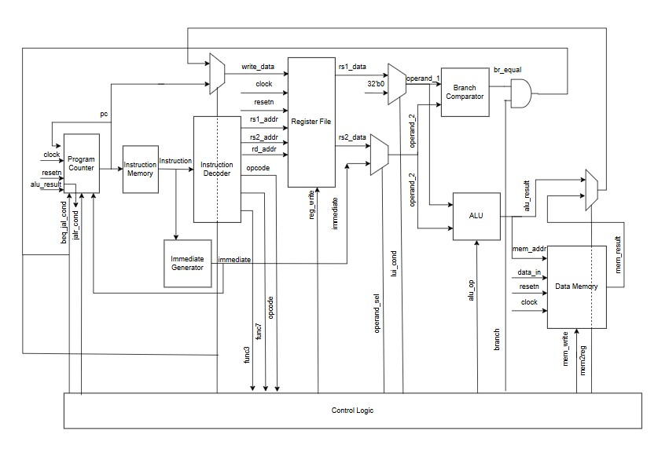

# riscv_dev
# 32-Bit RISC-V Single Cycle Processor
A single-cycle RISC-V processor core written in Verilog. This core implements a targeted subset of the RV32I Base Integer Instruction Set, specifically supporting 9 core instructions: ADD, ADDI, SUB, LUI, BEQ, JALR, JAL, LW, and SW.

The block diargam of the core is shown. 

This repository includes the Register Transfer Level (RTL) datapath, control logic, testbenches, and a Makefile simulation environment.

## Architecture Overview

The datapath is organized into modular Verilog components, keeping the hierarchy easy to navigate and modify.

1. **riscv_dev.v**: The top-level wrapper integrating all internal modules. 

2. **control_logic.v**: The main instruction decoder that drives the multiplexers, ALU operations, and memory read/write signals for the 9 supported instructions.

3. **alu.v**: Handles mathematical operations and physical memory address calculations.

4. **program_counter.v** : Keeps track of where the CPU is within the code and calculates the address of the instruction to be executed.

5. **instr_dec.v** : Decodes the 32-bit instruction into its appropriate sub-fields, such as the opcode, destination register (rd), and source registers (rs1, rs2).

6. **reg_file.v**: The 32x32-bit register file.

7. **imem.v & dmem.v**: Instruction and Data memory modules. The data memory correctly handles RISC-V byte-addressable word alignment.

8. **immediate_gen.v**: Extracts and extends immediate payloads from the supported instruction formats.

9. **branch_comp.v**: A dedicated comparator for precise control-flow evaluation during branch instructions.

##  Repository Structure

    src/: Contains all the .v Verilog source files for the processor modules.

    tb/: Contains the testbenches and machine code files.

    assets/: Contains documentation assets, including the datapath block diagram.

*(Note: The simulation working directory is not tracked in this repository. It will be generated automatically when you run the compilation scripts locally).*

## Quick Start & Tutorial
Follow these steps to clone the repository, load a program, and execute a simulation on your local or remote Linux environment.

1. Clone the Repository  
    *-* Open your terminal and clone the project:   
        `git clone <https://github.com/GithubAamna/mini-riscv.git>`  
    *-* Navigate into the folder:    
        `cd mini-riscv` 

2. Prepare the Instruction Memory  
    The processor executes raw 32-bit hexadecimal machine code. The testbench is configured to use the $readmemh task to pull this code from a hex file and load it into the instruction memory (imem.v) at time zero.  
    *-* Navigate to the tb/ directory.  
    *-* Open program.hex.  
    *-* Add your machine code, with one 32-bit instruction per line (in hex format, without the 0x prefix). Ensure you are only using machine code generated from the 9   supported instructions.  

3. Compile and Simulate
    This project is structured to keep all messy compilation files out of your source directories.
    Run your specific Makefile targets from the root of the project to build the directory and run the simulation.   
    `make compile`  
    ` make run`  

4. Verify the Output
    Check your terminal console for the simulation output. You can monitor the readouts generated by your testbench to verify that the datapath routed correctly and your memory interactions were successful.
